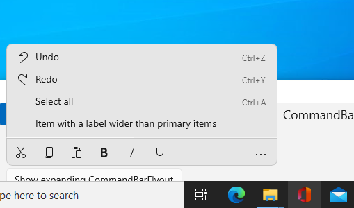

Popup additional layout properties
===

# Background

[Popups](https://docs.microsoft.com/uwp/api/Windows.UI.Xaml.Controls.Primitives.Popup)
and
[flyouts](https://docs.microsoft.com/uwp/api/Windows.UI.Xaml.Controls.Primitives.FlyoutBase)
in XAML are given two modes of display:
they can either appear as part of the rest of XAML,
in which case they're confined to the bounds of the XAML root, or they can appear in their own HWND, which
allows them to escape the bounds of the XAML root.  This is common for elements such as context menus.

[CommandBarFlyout](https://docs.microsoft.com/uwp/api/Windows.UI.Xaml.Controls.CommandBarFlyout) 
is one such element, but since it's defined in the WinUI 2 controls library
rather than in the OS, it does not
have access to the HWND used to allow it to escape the XAML root's bounds.  As such, it has no way to
determine which monitor it's being displayed in, which makes it unable to know whether it has enough visual space
to open the popup for its secondary commands _below_ its primary commands or whether it should open them above instead.

This proposed API adds three properties and an event to Popup which will allow apps to specify where it logically
desires a popup
to be displayed relative to another element, and then respond to where system XAML was able to actually place
the popup.  This will allow elements such as `CommandBarFlyout` to be able to rely on system XAML for the placement of their
child popups in a way that will take monitor or app bounds into account without needing to do that accounting manually.

## Visual Examples

**Opening down**

When CommandBarFlyout has enough space below its primary commands, we want it to open down.

Secondary commands flyout closed:


Secondary commands flyout open:


** Opening up**

When CommandBarFlyout does *not* have enough space below its primary commands, we want it to be able to open up.

Secondary commands flyout closed:


Secondary commands flyout open:



# API Pages

## Popup class

```csharp
class Popup
{
    // Existing APIs
    // ...

    // New APIs
    UIElement PlacementTarget { get; set; }
    PopupPlacementMode DesiredPlacement { get; set; }
    PopupPlacementMode ActualPlacement { get; }
    
    public event System.EventHandler<object> PlacementChanged;
}
```

The example below shows how the `Placement` APIs are used by the 
[CommandBarFlyout](https://docs.microsoft.com/uwp/api/Windows.UI.Xaml.Controls.CommandBarFlyout)
to position its
[CommandBarFlyoutCommandBar](https://docs.microsoft.com/uwp/api/Windows.UI.Xaml.Controls.Primitives.CommandBarFlyoutCommandBar)'s
secondary commands Popup, and how to respond to the event raised when XAML places the Popup.

```xml
<!-- Part of the CommandBarFlyoutCommandBar's default template -->
<Popup
    x:Name="OverflowPopup"
    PlacementTarget="{Binding ElementName=PrimaryItemsRoot}"
    DesiredPlacement="Bottom">
</Popup>
```

```csharp
void OnApplyTemplate()
{
    m_overflowPopup = GetTemplateChild("OverflowPopup");
    m_overflowPopup.PlacementChanged += OnOverflowPopupPlacementChanged;
}

void OnOverflowPopupPlacementChanged(object sender, object args)
{
    UpdateVisualState(useTransitions: false);
}

void UpdateVisualState(bool useTransitions)
{
    if (m_overflowPopup.ActualPlacement == PopupPlacementMode.Top)
    {
        VisualStateManager.GoToState(this, "ExpandedUp", useTransitions);
    }
    else
    {
        VisualStateManager.GoToState(this, "ExpandedDown", useTransitions);
    }
}
```


## Popup.PlacementTarget property

Use this property to describe which element the `Popup` should be positioned relative to.
Defaults to `null`.

If this is `null`, then `DesiredPlacement` is ignored, `ActualPlacement` is always `None`, and
`PlacementChanged` is never raised.  If the `Popup` is in the visual tree, `PlacementTarget` will override what its
position would otherwise be set to by layout.  Setting `PlacementTarget` to an element under a different XAML root than
`Popup.XamlRoot` is invalid and will throw an `ArgumentException`.

_Spec note: this property is analogous to the
[FlyoutBase.Target](https://docs.microsoft.com/uwp/api/Windows.UI.Xaml.Controls.Primitives.FlyoutBase.Target)
property, but `Popup.Target` looked confusing, so we added the `Placement` prefix._

## Popup.DesiredPlacement property

Use this property to describe how the you would ideally like the `Popup`
positioned relative to `PlacementTarget`.  Defaults to `None`.

If this is `None`, then `PlacementTarget` is ignored,
`ActualPlacement` is always `None` and `PlacementChanged` is never raised. 
If both `DesiredPlacement` and `PlacementTarget` are set and `HorizontalOffset` and/or `VerticalOffset`
are also set, then the latter two properties will offset the `Popup` from where it would have been
placed by `DesiredPlacement` and `PlacementTarget` alone.

## Popup.ActualPlacement property

Use this read-only property to determine where the popup was positioned.
Will always be `None` if either `PlacementTarget` and `DesiredPlacement` are not set.

## Popup.PlacementChanged event

Raised whenever XAML sets the value of `ActualPlacement`,
which allows apps to respond to where a `Popup` was placed.

For example, use this to determine the visual state to go into, 
based on whether a `Popup` is appearing above or below `PlacementTarget`.

This event is raised before the screen is refreshed, meaning that any visual changes made
in response to this event can be made before anything is drawn to the screen at the new position.
Will never be raised if either `PlacementTarget` and `DesiredPlacement` are not set.


## PopupPlacementMode enum

_Spec note: This is designed to align with the existing
[FlyoutPlacementMode](https://docs.microsoft.com/uwp/api/Windows.UI.Xaml.Controls.Primitives.FlyoutPlacementMode)
enum._


```csharp
enum PopupPlacementMode
{
    None,
    Top,
    Bottom,
    Left,
    Right,
    TopEdgeAlignedLeft,
    TopEdgeAlignedRight,
    BottomEdgeAlignedLeft,
    BottomEdgeAlignedRight,
    LeftEdgeAlignedTop,
    LeftEdgeAlignedBottom,
    RightEdgeAlignedTop,
    RightEdgeAlignedBottom
}
```

# API Details

```csharp
namespace Windows.UI.Xaml.Controls.Primitives
{
    [webhosthidden]
    enum PopupPlacementMode
    {
        None,
        Top,
        Bottom,
        Left,
        Right,
        TopEdgeAlignedLeft,
        TopEdgeAlignedRight,
        BottomEdgeAlignedLeft,
        BottomEdgeAlignedRight,
        LeftEdgeAlignedTop,
        LeftEdgeAlignedBottom,
        RightEdgeAlignedTop,
        RightEdgeAlignedBottom
    };

    [webhosthidden]
    interface IPopup2
    {
        Windows.UI.Xaml.UIElement PlacementTarget;
        Windows.UI.Xaml.Controls.Primitives.PopupPlacementMode DesiredPlacement;
        Windows.UI.Xaml.Controls.Primitives.PopupPlacementMode ActualPlacement { get; };
        
        event Windows.Foundation.EventHandler<Object> PlacementChanged;
        
        static Windows.UI.Xaml.DependencyProperty PlacementTargetProperty{ get; };
        static Windows.UI.Xaml.DependencyProperty DesiredPlacementProperty{ get; };
        static Windows.UI.Xaml.DependencyProperty ActualPlacementProperty{ get; };
    };
}
```
